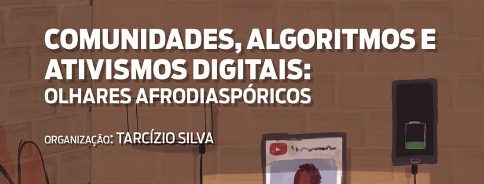

# Clube Leitura InspirAda

Clube de leitura focado na formação intelectual e social de estudantes,
profissionais e pessoas interessadas em tecnologia, computação e
envolvimento de outras áreas como ciências humanas e comunicação.

[Site](http://www.inspiradanacomputacao.com/blog/clube-de-leitura-inspirada-adota-livro-que-aborda-relacao-entre-tecnologia-e-questoes-raciais)
\| [Telegram](https://t.me/ClubeLeituraInspirAda)

## Abril

#### Livro: Comunidades, Algoritmos e Ativismos Digitais: Olhares Afrodiaspóricos - Organização: Tarcízio Silva
#### Editora LiteraRUA: [Versão Física][livro01-compre] | [Versão Digital Gratuita][livro01-ebook]
#### [Goodreads][livro01-goodreads] | [Skoob][livro01-skoob]

- (06/04) Live 1 - Lançamento do Clube, Prefácio e Apresentação
[
[Assistir](https://youtu.be/lZjSEpgFTh0) \|
[Anotações](./live-01.md)                \|
[Avaliar](https://forms.gle/PnnBBfNFw6uWZwmP7)
]

- (13/04) Live 2 - Capítulo 1
[
[Assistir](https://youtu.be/foy77XEVcYY) \|
[Anotações](./live-02.md)                \|
Avaliar
]

- (20/04) Live 3 - Capítulo 2
[
[Assistir](https://youtu.be/bpYCfMlDXu4) \|
[Anotações](./live-03.md)                \|
Avaliar
]

- (27/04) Live 4 - Capítulo 3
[
[Assistir](https://youtu.be/oU-EgiIvdLE) \|
[Anotações](./live-04.md)                \|
Avaliar
]

- (04/05) Live 5 - Capítulo 4
[
[Assistir](https://youtu.be/SDMLMMhHolw) \|
[Anotações](./live-05.md)                \|
Avaliar
]

- (11/05) Live 6 - Capítulo 5
[
[Assistir](https://youtu.be/59C3190AA4g) \|
[Anotações](./live-06.md)                \|
Avaliar
]

- (18/05) Live 7 - Capítulo 6
[
[Assistir](https://youtu.be/wNgakkFNhvI) \|
[Anotações](./live-07.md)                \|
Avaliar
]

- (25/05) Live 8 - Capítulo 7
[
[Assistir](https://youtu.be/fl9cmTMH1Ic) \|
[Anotações](./live-08.md)                \|
Avaliar
]

- (01/06) Live 9 - Capítulo 8
[
[Assistir](https://youtu.be/9ZibRxOBllU) \|
[Anotações](./live-09.md)                \|
Avaliar
]

- (08/06) Live 10 - Capítulo 9
[
[Assistir](https://youtu.be/NJ3cFjlAVBs) \|
[Anotações](./live-10.md)                \|
Avaliar
]

- (15/06) Live 11 - Capítulo 10
[
[Assistir](https://youtu.be/osq_VGi0gMM) \|
[Anotações](./live-11.md)                \|
Avaliar
]

- (22/06) Live 12 - Capítulo 11
[
[Assistir](https://youtu.be/Zy9JDcBRjsw) \|
[Anotações](./live-12.md)                \|
Avaliar
]

- (29/06) Live 13 - Capítulo 12
[
[Assistir](https://youtu.be/Jt1NyySz5Yc) \|
[Anotações](./live-13.md)                \|
Avaliar
]

- (06/07) Live 14 - Capítulo 13
[
[Assistir](https://youtu.be/Tz-WSqxZ6Z4) \|
[Anotações](./live-14.md)                \|
Avaliar
]

- (13/07) Live 15 - Capítulo 14
[
[Assistir](https://youtu.be/AxCEP0Mo_l4) \|
[Anotações](./live-15.md)                \|
Avaliar
]

## Como sugerir livros?

Abra uma [issue](https://github.com/inspiradanacomputacao/clubeleiturainspirada/issues)

[livro01-compre]:     http://www.literarua.com.br/livro/olhares-afrodiasporicos
[livro01-ebook]:      https://bit.ly/ComunidadesDigitais
[livro01-skoob]:      https://www.skoob.com.br/comunidades-algoritmos-e-ativismos-digitais-1136137ed1139762.html
[livro01-goodreads]:  https://www.goodreads.com/book/show/53005858-comunidades-algoritmos-e-ativismos-digitais
